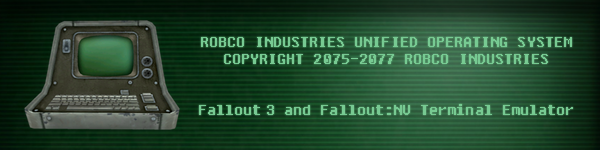

---

#Table of Contents

- [Overview](#overview)
- [To-Do](#to-do)
- [Dependencies](#dependencies)

#<a name="overview"></a>Overview

A Fallout terminal emulator as seen in Fallout 3 and Fallout: New Vegas.

I plan to flesh out this program in C, then write at least Ruby and C++ versions of it.

A goal of mine is to make the finished code extremely clean and readable.

##Usage:
Compile with Make from project root:
```
$ make
```

Run program hackterm:
```
$ ./hackterm
```

Program will stay running until attempts are gone, or quit key is pressed (see secret codes section below for all special keys). ^Z or ^C also work just as well!

##Secret codes:

For aspects of the game that I have not implemented yet, I have in place keys that the user can press in order to achieve certain effects:

| Key | Effect                                                  |
| --- | ------------------------------------------------------  |
| 'q' | Quit application.                                       |
| 'e' | Prints a dummy "Dud removed." message to messages area. |
| '-' | Subtracts one attempt.                                  |

#<a name="to-do"></a>To-Do
- Generate random words of n length.
- Generate and add bracket 'hacks'.
- Randomly place objects on board.
- Right arrow from highlighted word should move to next board space on same line.
- Allow user to control experience from command line args.
- - Option for user to type in terminal commands by themselves or have it autotype.
- - Option for difficulty settings.
- Implement terminal 'printout' effect.
- Add capability of running a pseudo-terminal once game is complete.
- - Access some kind of fun files.
- Generate registers dynamically so every game is a little different.
- Allow user to type in password if desired.


#<a name="dependencies"></a>Dependencies

+ [ncurses](http://www.gnu.org/software/ncurses/) - Great library for cursor management.